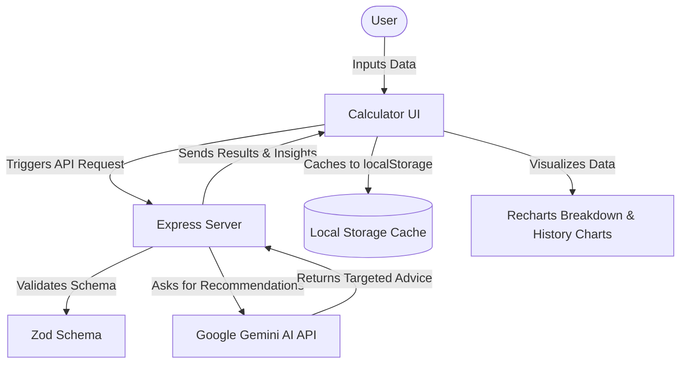

# 🌍 Carbon Tracker

[](https://react.dev/)
[](https://vitejs.dev/)
[](https://tailwindcss.com/)
[](https://www.typescriptlang.org/)
[](https://ai.google.dev/)
[](https://vercel.com/)

An interactive, high-performance, and accessibility-compliant Carbon Footprint Calculator. Estimate your annual CO₂ equivalent greenhouse impact across transport, housing, diet, and consumption sectors, and receive tailor-made reduction strategies powered by Google's Gemini AI.

---

## ✨ Features

* **⚡ Intuitive Calculator Form**: Easy-to-use input form spanning transportation (cars by fuel type, trains, buses, short/long-haul flights), home energy utilities (electricity, gas), household size, dietary patterns, and material consumption indexes.
* **🤖 AI-Powered Reduction Insights**: Connects with Google's Gemini API to instantly generate targeted, high-priority action recommendations prioritized by carbon conservation potential and timeframe feasibility.
* **📊 Visual Footprint Breakdown**: Visualizes your annual impact per sector using dynamic charts, comparing your footprint directly against the **Global Average** and the **Paris Agreement Target limit (1.5°C)**.
* **💾 Local History & Caching**: Tracks past entries locally with instant browser storage caching, offering rapid load times and offline accessibility.
* **📈 Historical Trend Tracking**: Automatically charts and tables past entries to visualize your progress over time.

---

## 🛠️ Tech Stack

* **Frontend**: React 19, TypeScript, Tailwind CSS v4, Recharts, Lucide Icons, Motion (Framer)
* **Backend**: Express API gateway (Node.js) serving local assets and handling variant validation
* **AI Model**: Google Gemini API via `@google/genai`
* **Build Tooling**: Vite, esbuild, custom postbuild script for CSS-inlining optimizations

---

## 📐 Architecture & Data Flow



---

## 🚀 Performance & Accessibility Core

We prioritize visual excellence, compliance, and speed:
1. **WCAG AA/AAA Contrast Standards**: Hand-picked harmonious color palettes satisfying color contrast ratios for text elements, interactive button states, and tabs.
2. **Eliminated Render-Blocking Paths**:
   - Google Fonts are hosted locally inside the source bundle and preloaded in parallel.
   - Heavy elements (charts, tables) are dynamically lazy-loaded using `React.Suspense` to guarantee an ultra-fast Time-To-Interactive (TTI).

---

## 📁 Project Structure

```text
├── api/                  # Express serverless API routes
├── src/
│   ├── assets/           # Local assets and preloaded fonts
│   ├── components/       # Reusable components (Charts, Tables, Progress bars)
│   ├── utils/            # Helper files and category configurations
│   ├── App.tsx           # Main application state and router layout
│   ├── types.ts          # Zod-derived TypeScript interfaces
│   └── main.tsx          # Client mounting entrypoint
├── index.html            # Core entry layout with font preloads
├── server.ts             # Local development Express server
├── package.json          # Dependency and build scripts definition
└── vite.config.ts        # Vite build bundler configuration
```

---

## 💻 Local Setup & Development

### Prerequisites

- **Node.js** (v18 or higher recommended)
- A **Gemini API Key** from [Google AI Studio](https://aistudio.google.com/)

### Step-by-Step

1. **Clone the Repository**:
   ```bash
   git clone <repository-url>
   cd Carbon-Tracker
   ```

2. **Install Dependencies**:
   ```bash
   npm install
   ```

3. **Configure Environment Variables**:
   Create a `.env` file in the root directory (you can copy `.env.example` as a template):
   ```bash
   PORT=3000
   GEMINI_API_KEY=your_gemini_api_key_here
   ```

4. **Start local dev server**:
   ```bash
   npm run dev
   ```
   Open `http://localhost:3000` in your web browser.

---

## 🚢 Production Build & Deployment

To compile the production assets:

```bash
npm run build
```

This will run Vite build, inline CSS for optimal render performance, and compile the backend `server.ts` into a lightweight, standalone `dist/server.cjs` file.

### Deploying to Vercel

This application is ready to deploy to Vercel with zero-config serverless function hosting:

```bash
npx vercel --prod
```
